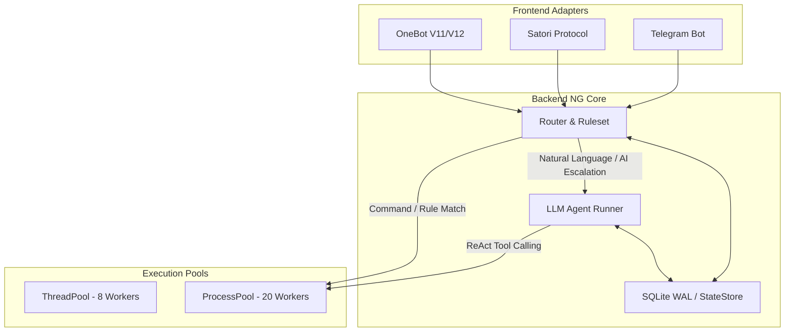

# Nemo Bot Backend NG (Next Generation) 🐻

[](https://www.python.org/downloads/)
[](https://opensource.org/licenses/MIT)
[](#architecture-overview)

**Nemo Bot Backend NG** is the next-generation, high-performance backend for Nemo Bot. Redesigned from the ground up, it combines a highly scalable modular **Plugin System**, an autonomous **LLM Agent Loop (ReAct / CoT)**, and a resilient **Multi-Frontend Dispatching Architecture**.

---

## 🚀 Key Features

- **🧠 Autonomous Agent Engine**: Built-in LLM Agent runner with ReAct reasoning, parallel tool calling, thought broadcasting, and dynamic context memory.
- **⚡ Dual-Tier Executor Architecture**: 
  - **`ThreadPoolExecutor`** (8 workers): Handles HTTP webhook ingress, routing, LLM reasoning loops, and message dispatching without blocking WSGI threads.
  - **`ProcessPoolExecutor`** (20 workers): Sandbox isolation for executing synchronous or CPU-heavy plugin tools (e.g., image rendering, mathematical evaluation, data analysis).
- **🔌 Unified Plugin Ecosystem**: Plugins in `plugins/` serve dual purposes: they can be triggered as traditional slash commands by humans or invoked dynamically as tools by the LLM Agent.
- **🛡️ Robust Security & Exception Handling**: Centralized generic exception handling with standard HTTP/FTP status code mapping for clear user feedback and LLM self-correction.
- **⏰ Built-in Scheduler & Reflection**: Support for cron-based background jobs, delayed task execution, and automated self-reflection cycles.
- **🎨 Headless Multimodal Rendering**: High-fidelity LaTeX and Markdown to Image rendering via custom Matplotlib/Pillow engines with cross-platform CJK font fallbacks.

---

## 🏗️ Architecture Overview



---

## ⚙️ Configuration Boundaries

In `nemo-bot-backend-ng`, configuration is strictly divided into two distinct layers to guarantee security, process isolation, and runtime flexibility:

### 1. Static Infrastructure Layer (`config.yml`)
`config.yml` is reserved strictly for **infrastructure and deployment-level settings**. These settings are read-only at runtime and require a service restart to apply:
- LLM API keys, Base URLs, and Provider definitions (`llm.providers`).
- Network ports, webhook endpoints, and SSL settings (`server.port`).
- Hardcoded Superuser ID lists (`superusers: [...]`).
- Model fallbacks and default runtime parameters (`llm.models`).
> ⚠️ *Rule of Thumb*: If it contains a secret token, an IP address, or dictates how the bot physically binds to OS network interfaces, it belongs in `config.yml`. The Agent must **never** be granted permissions to mutate this file.

### 2. Dynamic Application Layer (`StateStore` / SQLite WAL)
Backed by SQLite in WAL (Write-Ahead Logging) mode, the `StateStore` (`data/nemo.sqlite`) manages **runtime business logic, user preferences, and agent memory**. It is designed for high-frequency dynamic mutation across worker processes:
- User and group-specific plugin preferences and verbose levels (`/verbose 0|1|2`).
- Dynamic alias mappings (`wt -> 天气`).
- Feature toggles (enabling/disabling specific plugins per chat scope).
- Long-term memory facts, conversation logs, and background job cursors.
> 💡 *Rule of Thumb*: If the configuration can be toggled via a chat command or learned autonomously by the Agent, it belongs in the `StateStore`.

---

## 🛠️ Installation & Quick Start

### 1. Prerequisites
- **Python 3.10+** (Recommended: Python 3.11 / 3.12)
- **uv** or standard `pip` package manager

### 2. Install Dependencies
```bash
# Using uv (Recommended)
uv pip install -r pyproject.toml

# Or using standard pip
pip install -e .
```

### 3. Initialize Configuration
Copy the template and configure your API keys:
```bash
cp config.yml.example config.yml
# Edit config.yml with your LLM provider credentials
```

### 4. Verify & Run
Before launching, run the mandatory health check to verify plugin integrity and routing schemas:
```bash
python app.py --check
```

If the health check passes:
```bash
python app.py
```

---

## 🧪 Testing

The repository includes a suite of unit and smoke tests located in `tests/`.

```bash
# Run all tests
python -m unittest discover tests/

# Run smoke tests
python -m unittest tests/test_smoke.py
```

---

## 📝 Plugin Development Guide

All legacy or new tools created in `plugins/` must adhere to the structural schema required by the core router and tool registry:

```python
from core.message import Message
from utilities import generic_exception_handler

# Required Module-Level Attributes
_name = "示例插件"
_command = ["example", "ex"]
_man = "用法: /example <参数>\n说明: 这是一个开发示例插件。"
_enabled = True
_tool_description = "提供给 LLM Agent 调用的详细功能描述，阐述该工具的输入输出期望。"

@generic_exception_handler
def bot_execute(message: Message, config: dict):
    # Note: To access DB inside worker processes, instantiate locally:
    from store.database import Database
    from store.state_store import StateStore
    db = Database()
    state_store = StateStore(db)
    
    # Plugin logic here...
    return "执行成功！"
```

---

## 📄 License

This project is licensed under the MIT License. Developed with ❤️ by Nemo & Antigravity.
